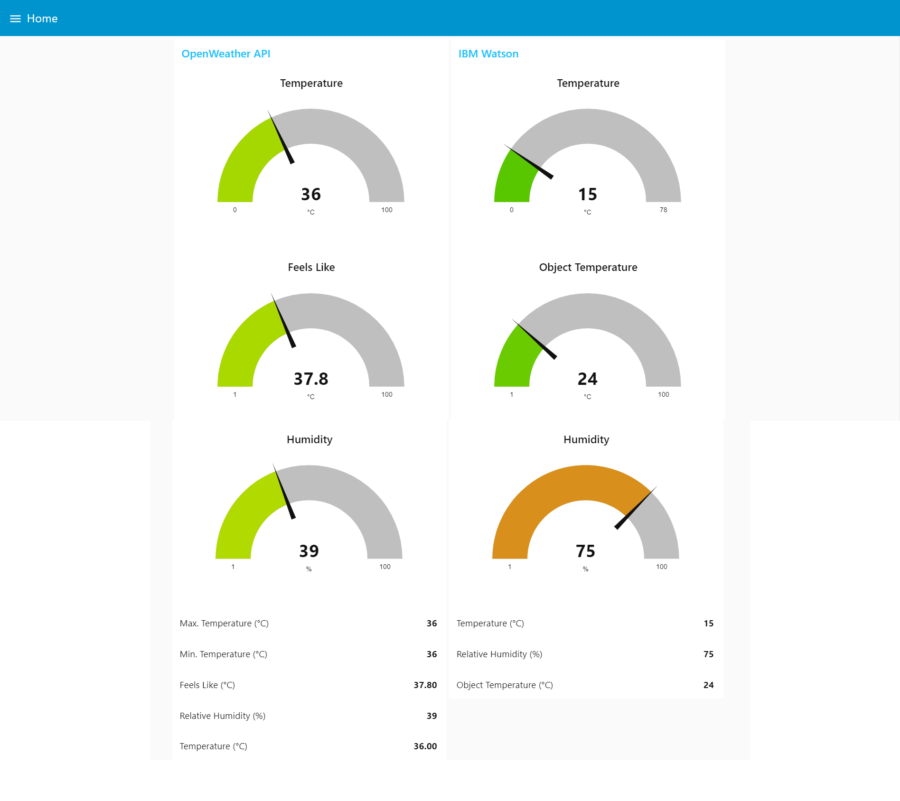
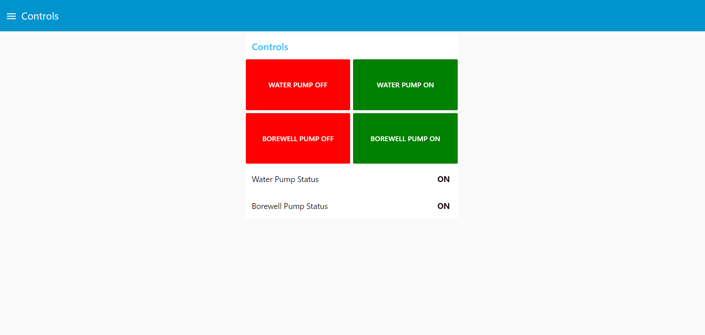
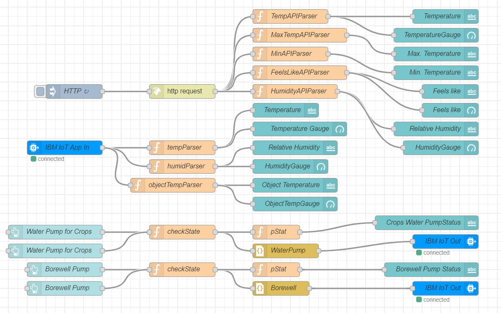
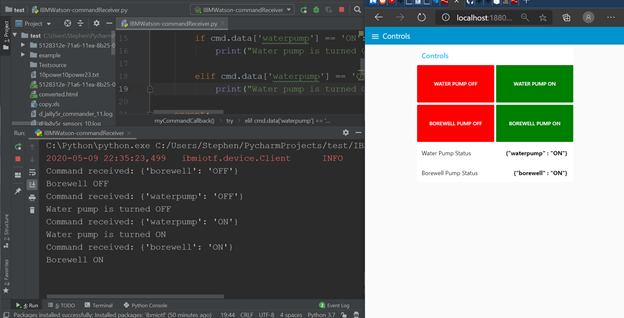

# A smart agriculture system for farmers with IoT

This is a system which can enable farmers to monitor and contro their farms with a web-based app built with Node-RED. It uses IBM Watson cloud platform as its backend. The web app's UI is shown below.

## Monitor

Data collected from sensors on the farm and data from OpenWeather's API. In this case farm data was simulated using a virtual platform [here.](https://watson-iot-sensor-simulator.mybluemix.net/)



## Controls

Buttons to control equipment on the farm remotely.




## Node-RED program flow



## Virtual Farm command receiver on Python

Commands sent from Node-RED and sent to the cloud and then are read by a Python script running locally to read the command and perform the intended action.



## Further reading

For further reading and more detail on how this was done, refer the [document](doc/Smart_Agriculture_system_based_on_IoT.pdf) in the ```doc``` folder of this repository.